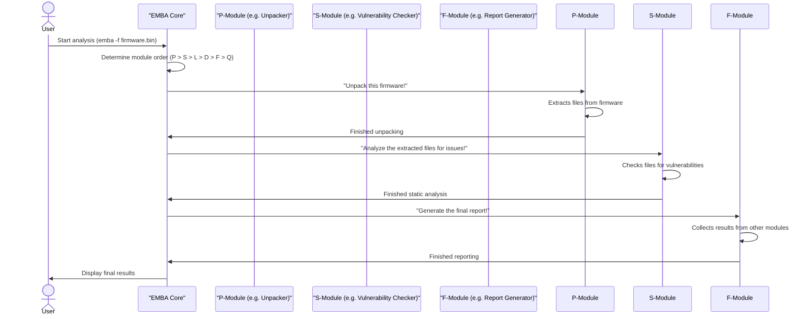
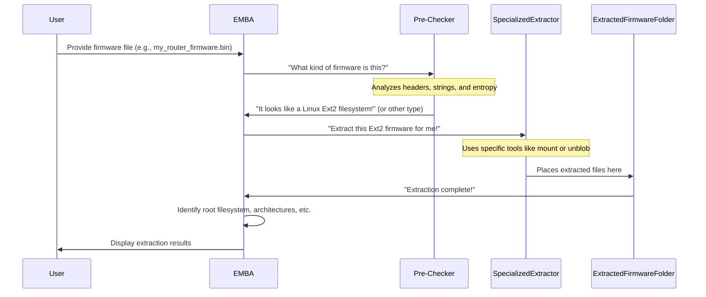
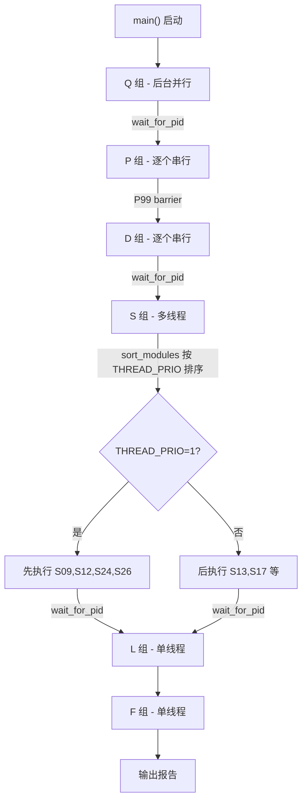

# EMBA 代理指南

EMBA 是一个基于 Bash（99%+）的固件安全分析器。

## 命令

| 操作 | 命令 |
|---|---|
| 运行分析 | `sudo ./emba -f <firmware> -l <logdir>` |
| 运行单个模块 | `sudo ./emba -f <firmware> -l <logdir> -m S10` |
| 运行模块组 | `sudo ./emba -f <firmware> -l <logdir> -m P` |
| 严格模式 | 添加 `-S` |
| 跳过更新检查 | `NO_UPDATE_CHECK=1 sudo -E ./emba ...` |
| 仅检查依赖 | `sudo ./emba -d 1` |
| 完整安装 | `sudo ./installer.sh -d` |
| CI 安装 | `sudo ./installer.sh -g` |
| 运行全部检查 | `./check_project.sh` |
| 快速检查 | `./check_project.sh --fast` |
| ShellCheck 单个文件 | `shellcheck -x -o require-variable-braces <file>` |
| 构建 Docker | `docker-compose build --no-cache --pull` |
| 运行 Docker | `FIRMWARE=/path LOG=/path EMBA=$PWD docker-compose up emba` |

所有模块接受 `-h` 查看帮助。使用 `-p <profile>` 选择 `scan-profiles/` 中的扫描配置文件。

## 架构

- **入口：** `emba` — 加载 `helpers/helpers_emba_*.sh`，从 `modules/` 加载模块
- **模块前缀：** `P`（提取）、`S`（静态分析）、`D`（差异对比）、`L`（仿真）、`F`（报告）、`Q`（并行任务）
- **辅助库**（`helpers/`）提供共享函数（打印、路径处理、HTML 生成、SBOM、依赖检查）

## 代码规范

- **缩进：** 2 空格，无制表符
- **函数：** snake_case，函数之间空一行
- **变量：** 全局变量 UPPER_CASE，局部变量前缀 `l`（如 `lVAR`），nameref 前缀 `lr`
- **局部变量必须初始化：** `local lVAR=""`
- **始终使用花括号：** `${VAR}` 而非 `$VAR`
- **使用 `$(...)`** 而非反引号
- **使用 `[[ ]]`** 而非 `[ ]`
- **使用 `local -n`** 声明 nameref 参数
- **`export`** 用于跨函数的变量
- **Shebang：** `#!/bin/bash -p`

## 测试与质量

- **无测试框架。** 集成测试通过 CI（`default_install.yml`）：安装 EMBA，在 D-Link 固件上运行，检查输出产物。
- **检查门禁：** ShellCheck + Semgrep + 自定义检查（变量初始化、注释格式、JSON 有效性、版权头、文件权限）— 均由 `./check_project.sh` 执行。
- **ShellCheck 参数：** `-x -o require-variable-braces`（CI 中强制使用）。
- **严格模式**（`-S` 或通过 `wickStrictModeFail.sh` 设置 `set -euo pipefail`）是所有新代码的必选项。

## Docker

- 使用 `kalilinux/kali-rolling`。需要特权模式（固件提取需要 FUSE、挂载）。
- 容器需要 tmpfs 挂载各种工具缓存（详见 `docker-compose.yml`）。
- 两个服务：`emba`（主）和 `emba_quest`（并行分析，只读根文件系统）。

## 关键文件

| 文件 | 用途 |
|---|---|
| `emba` | 主入口（1060 行） |
| `installer.sh` | 依赖安装 |
| `check_project.sh` | 多工具检查器（517 行） |
| `config/VERSION.txt` | 项目版本（`2.0.0`） |
| `config/bin_version_identifiers/*.json` | ~200 个版本检测规则 |
| `scan-profiles/*.emba` | 预定义的扫描配置文件 |
| `modules/template_module.sh` | 新模块模板 |

## CI 工作流（共 18 个）

开发期间相关的关键工作流：
- `check_project.yml` — 每次 push/PR 执行：`./check_project.sh`
- `shellcheck.yml` — 每次 push/PR 执行，参数 `-x -o require-variable-braces`
- `semgrep.yml` — 每次 push/PR 执行 semgrep
- `default_install.yml` — 完整安装 + 真实固件扫描（集成测试）

## 启动流程
`main()` 在 `emba:345`

| Phase | Modules | Key logic |
|---|---|---|
| **初始化** | - | `import_helper` → `set_defaults` → `import_module` → `welcome` → 参数解析 → `dependency_check` |
| **Docker** | - | `USE_DOCKER=1` 时在容器内运行，否则在宿主机 |
| **RESCAN_SBOM** | - | 仅复用 SBOM 重新做 CVE 分析（F17），跳过其他所有阶段 |
| **Quests** | Q | 独立 quest 容器/进程，与主流程并行执行 |
| **预检查** | P | 固件识别、解包、OS 检测（`P*_*.sh`） |
| **Diff 模式** | D | 两个固件镜像对比（`D*_*.sh`） |
| **主检测** | S | 核心安全分析（`S*_*.sh`） |
| **系统仿真** | L | QEMU 全系统仿真（`L*_*.sh`，单线程） |
| **报告** | F | 结果聚合、CVE 分析、HTML 报告（`F*_*.sh`） |


### Docker 启动流程

`IN_DOCKER` 用于区分当前运行在宿主机还是 Docker 容器内，影响路径、行为、清理逻辑。

#### 赋值链

| 阶段 | 位置 | 值 |
|---|---|---|
| 默认值 | `helpers/helpers_emba_defaults.sh:41` (`set_defaults`) | `export IN_DOCKER=0` |
| 宿主机解析参数 | `helpers/helpers_emba_parameter_parser.sh:95` | `-i` 参数 → `export IN_DOCKER=1` |
| 容器内 | Dockerfile build 时 `installer.sh -s -D` | `installer.sh:112` → `export IN_DOCKER=1` |

#### Docker 启动入口
`emba:688-840`

当 `USE_DOCKER=1`（默认）时，`emba` 主脚本不直接运行模块，而是通过 `docker compose run` 启动容器。

#### 执行步骤

| 步骤 | 行号 | 说明 |
|---|---|---|
| **权限检查** | 692–699 | 非 root 用户且不在 docker 组时报错退出 |
| **参数过滤** | 701–715 | 用 `getopts` 重新解析参数，剔除 Docker 专属参数 |
| **等待镜像** | 726–737 | 最多等 10 秒，等待 `embeddedanalyzer/emba` 镜像就绪 |
| **保存宿主机信息** | 742–750 | 固件路径、日志目录、原始命令写入日志目录，供容器内使用 |
| **按模式启动容器** | 757–813 | 见下方三种模式 |
| **清理与退出** | 816–839 | 根据容器退出码 `D_RETURN` 输出成功/失败信息并退出 |

#### 参数过滤
`emba:703-714`

`D\|f\|i\|l\|o` 被从 `ARGUMENTS` 中移除，因为：
- `-f <firmware>` → volume 映射到 `/firmware`
- `-l <logdir>` → volume 映射到 `/logs`
- `-i` → 由 host 硬编码注入命令字符串
- `-o` → diff 模式第二固件，额外 volume 挂载
- `-D` → 容器提取，由宿主机侧处理

其余参数（`-a`, `-S`, `-m`, `-p` 等）原样保留在 `ARGUMENTS` 数组中传递给容器内实例。

#### 三种启动模式

1. **仅依赖检查**（`--only-dep`, `emba:757-764`）：依次启动 `emba` 和 `emba_quest` 容器，日志指向 `/tmp`。
2. **差异模式**（`DIFF_MODE`, `emba:765-769`）：额外挂载第二固件到 `/firmware2`，传递 `-o /firmware2`。
3. **默认模式**（`emba:770-813`）：
   - Quest 容器：以 `--detach` 后台启动 `emba_quest`
   - 主容器：根据 `SILENT` 决定前台（`--rm`）或后台（`--detach`）运行
   - 后台模式下轮询容器状态直至退出，然后输出聚合结果（`f50_base_aggregator.txt`）

#### 启动命令示例
`emba:784`

```bash
"${DOCKER_COMPOSE[@]}" run --rm emba \
  -c './emba -l /logs -f /firmware -i "$@"' _ "${ARGUMENTS[@]}"
```
- Dockerfile 的 `ENTRYPOINT` 是 `/bin/bash`（无 CMD）
- `-c` 后的命令字符串在容器内执行，其中**硬编码了 `-i`**
- `_` 是 `$0` 占位符，`"${ARGUMENTS[@]}"` 是其他用户参数

#### 容器内执行

1. bash 执行 `./emba -l /logs -f /firmware -i <other_args>`
2. `set_defaults` 设 `IN_DOCKER=0`，随后 `emba_parameter_parsing` 解析 `-i` 覆盖为 `IN_DOCKER=1`
3. `IN_DOCKER=1` 控制的行为：
   - 重设 `EXT_DIR="/external"`
   - 不打印 web-report URL、不启动 `print_running_modules`/`kernel_downloader`/通知进程
   - 日志目录权限恢复给宿主用户
   - 模块中跳过宿主机特有的操作（如 metasploit 服务、系统仿真端口检查等）

#### Docker Volume 挂载

`docker-compose.yml` 中定义了以下挂载。注意 `EXT_DIR="/external"`，但并非所有 `external/` 下的文件都挂载到了 `/external/`：

| Volume (宿主机 → 容器) | 说明 |
|---|---|
| `${FIRMWARE}/` → `/firmware:ro` | 固件文件 |
| `${LOG}/` → `/logs` | 日志输出 |
| `${EMBA}/` → `/emba:ro` | 整个项目根目录 |
| `${EMBA}/external/linux_kernel_sources/` → `/external/linux_kernel_sources:ro` | 内核源码 |
| `${EMBA}/external/nvd-json-data-feeds/` → `/external/nvd-json-data-feeds:ro` | NVD 数据 |
| `${EMBA}/external/android-rom-extract/` → `${EXT_DIR}/android-rom-extract:ro` | 安卓镜像提取脚本 |

其余自定义的 `external/` 下的文件 **没有被挂载** 到 `/external/`，因此在 Docker 下依赖这些工具的模块会因 `EXT_DIR="/external"` 而找不到文件。

## 模块

| Category | Prefix                            | Purpose                                                | Example Task                                          |
| :------- | :-------------------------------- | :----------------------------------------------------- | :---------------------------------------------------- |
| **P**    | Pre-Analysis                      | Prepares the firmware, extracts files, initial scans.  | Unpacking the firmware (like a ZIP file).             |
| **S**    | Static Analysis                   | Examines files without running the code.               | Checking code for known weaknesses.                   |
| **L**    | Live Emulation (Dynamic Analysis) | Runs parts of the firmware in a simulated environment. | Testing a web interface that appears in the firmware. |
| **D**    | Diffing Analysis                  | Compares two firmware versions to find differences.    | Identifying changed files between two updates.        |
| **F**    | Final Reports                     | Generates summaries, Software Bill of Materials.       | Creating a list of all software components.           |
| **Q**    | AI (Experimental)                 | Uses AI models for advanced insights (optional).       | Asking AI questions about a suspicious code snippet.  |


Here’s a simplified sequence of what happens:



### 固件提取

提取过程



#### 1.初始检查（预检查）：

EMBA首先运行一个“预检查”模块（`P02_firmware_bin_file_check.sh`）。这个模块就像一个快速扫描器，会检查固件文件的特性（比如文件类型、校验和初始字节），以猜测它可能使用的固件类型。
以下是EMBA如何检测固件类型的简化说明：

```shell
# From modules/P02_firmware_bin_file_check.sh
# Simplified version of fw_bin_detector function
fw_bin_detector() {
  local lCHECK_FILE="${1:-}"
  local lFILE_BIN_OUT # Stores output of 'file' command

  # Use the 'file' command to identify the file type
  lFILE_BIN_OUT=$(file "${lCHECK_FILE}")

  # Check for specific patterns in the file output
  if [[ "${lFILE_BIN_OUT}" == *"Linux rev 1.0 ext2 filesystem data"* ]]; then
    # If it's an Ext2 filesystem, set a flag for other modules
    print_output "[+] Identified Linux ext2 filesytem"
    export EXT_IMAGE=1 # This variable tells EMBA to use the Ext extractor
  elif [[ "${lFILE_BIN_OUT}" == *"VMware4 disk image"* ]]; then
    # If it's a VMDK image, set another flag
    print_output "[+] Identified VMWware VMDK archive file"
    export VMDK_DETECTED=1 # This flag triggers the VMDK extractor
  # ... other detection logic for different types
  fi
}
```

根据 `file`（用于识别文件类型的常用 Linux 命令）报告或其他内部检查，EMBA 会设置内部标志（如 EXT_IMAGE=1 或 VMDK_DETECTED=1）。
这些标志作为信号，提示下一步应激活专用的提取模块。EMBA还会生成固件的视觉“熵图”，有时可以揭示隐藏的加密部分。

#### 2.专用提取：

一旦EMBA确定固件类型，就会调用其众多专用提取模块之一。每个模块设计用于处理特定的固件格式或加密方案。

以下是一些具体提取器及其功能示例：

- EXT文件系统 Extractor（`P14_ext_mounter.sh`）
- Windows 可执行文件 Extractor（`P07_windows_exe_extract.sh`）
- Foscam Extractor（`P20_foscam_decryptor.sh`）
- Android OTA Extractor（`P25_android_ota.sh`）, 支持 Android OTA payload.bin 文件解包
- Unblob Extractor （`P55_unblob_extractor.sh`）
- Binwalk Extractor（`P50_binwalk_extractor.sh`）
- 深度递归 Extractor（`P60_deep_extractor.sh`）

#### 3.取出后组织与分析：
 
初次取出后，EMBA尚未完成。接着：
    
- **修复权限和符号链接**：固件镜像在解压后常常丢失文件权限或符号链接断裂。辅助脚本修复这些问题，使提取后的文件更易用于后续分析。`helpers/fix_bins_lnk_emulation.sh`
- **识别根目录**：`detect_root_dir_helper()`（`helpers/helpers_emba_prepare.sh:617`）自动识别根文件系统，填充全局数组 `ROOT_PATH` 和标志 `RTOS`。

  **ROOT_PATH** 存所有可能的根目录路径。全失败时以搜索路径自身为根目录并设 `RTOS=1`。

  | 机制 | 说明 | 条件 |
  |---|---|---|
  | **二进制解释器** | 从 ELF 的 `interpreter` 字段（如 `/lib/ld-uClibc.so.0`）反推父目录为根目录 | `SBOM_MINIMAL=0` |
  | **Busybox** | 通过 `bin/busybox` 路径反推根目录 | `SBOM_MINIMAL=0` |
  | **Shell** | 通过 `bin/bash` / `bin/sh` 路径反推根目录 | `SBOM_MINIMAL=0` |
  | **目录结构特征** | find 扫描 `sbin`/`bin`/`lib`/`etc`/`proc` 等标准目录，出现 ≥5 次才采纳 | 始终运行 |
  | **兜底** | 全失败 → `RTOS=1`，以搜索路径本身作为根目录 | 仅无匹配时 |
- **分析架构**：它扫描提取的可执行文件，以确定其CPU架构（如ARM、MIPS、x86）和字序值（数据存储在内存中的方式）。这些信息对于后续步骤如模拟至关重要。
- **`binary_architecture_threader()`**（`helpers/helpers_emba_prepare.sh:170`）：各 P 模块在提取到二进制文件时异步调用此函数。它对每个 ELF 计算 MD5 去重，用 `readelf` 提取 Machine 类型、Class（32/64 位）、Data（字节序）、Flags 及 `.comment` 节推断的架构，追写到 `P99_CSV_LOG`。后续 `architecture_check()` 消费该 CSV，通过计数投票决定固件整体架构（`export ARCH`），并为分析后端填充数据。

固件提取层设计为全面，确保 EMBA 能够获得设备内部软件的最完整视图。

整个过程都是自动化的。你给EMBA输入固件文件，它会自动应用“解包”团队来准备分析。

### [常见的固件类型和解压器](https://github.com/e-m-b-a/emba/wiki/The-EMBA-book-%E2%80%90-Chapter-1%3A-Firmware-Extraction-Layer#common-firmware-types-and-extractors)


这里有一张表格，总结了EMBA可以提取的一些常见固件类型及其使用的模块/工具：

| Firmware Type                                     | Key Detection Clue                   | Primary Extractor Module     | Core Tool/Method                   |
| :------------------------------------------------ | :----------------------------------- | :--------------------------- | :--------------------------------- |
| Generic Binary Firmware                           | Any binary blob                      | `P55_unblob_extractor.sh`    | `unblob`                           |
| Generic Binary Firmware                           | Any binary blob                      | `P50_binwalk_extractor.sh`   | `binwalk v3`                       |
| Linux Filesystem`extX`                            | `file` output contains "extX"        | `P14_ext_mounter.sh`         | `mount`                            |
| VMware VMDK Image                                 | `file` output contains "VMware"      | `P10_vmdk_extractor.sh`      | `guestmount`, `7z`                 |
| UEFI/BIOS Firmware                                | Strings like "UEFI", "BIOS"          | `P35_UEFI_extractor.sh`      | `UEFITool`, `uefi-firmware-parser` |
| DJI Drone Firmware                                | Specific header strings like "PRAK"  | `P40_DJI_extractor.sh`       | `dji-firmware-tools`, `unblob`     |
| Windows Executable (`.exe`)                       | `file` output contains "PE32"        | `P07_windows_exe_extract.sh` | `7z`                               |
| Android OTA (`payload.bin`)                       | Magic bytes "CrAU"                   | `P25_android_ota.sh`         | `payload_dumper.py`                |
| UBI Filesystem                                    | `file` output contains "UBI image"   | `P15_ubi_extractor.sh`       | `ubireader`                        |
| Zyxel Encrypted ZIP                               | `.ri` file + specific ELF executable | `P22_Zyxel_zip_decrypt.sh`   | `qemu-user`, `7z`                  |
| QEMU QCOW2 Image                                  | `file` output contains "QEMU QCOW2"  | `P23_qemu_qcow_mounter.sh`   | `qemu-nbd`                         |
| Compressed (GPG) Firmware                         | Specific GPG header bytes            | `P17_gpg_decompress.sh`      | `gpg`                              |
| Package Archives (`.deb`, `.apk`, `.ipk`, `.rpm`) | Filename extension, file type        | `P65_package_extractor.sh`   | `dpkg-deb`, `unzip`, `cpio`        |


### 调度

EMBA **没有显式的依赖图**，模块间依赖通过文件名编号约定 + 运行时 barrier + 强制启用三种机制保证。

#### 核心函数

| 函数 | 位置 | 作用 |
|---|---|---|
| `import_module()` | `emba:39` | 启动时扫描 `modules/` 加载所有 `*.sh`，注册模块的 main 函数 |
| `run_modules()` | `emba:86` | 核心调度引擎。按组字母 `find` 对应脚本，支持多线程/单线程、重启跳过、黑名单、手动选择 |
| `sort_modules()` | `emba:64` | 多线程模式下按 `THREAD_PRIO` 重排模块数组 |
| `max_pids_protection()` | - | 并发控制，限制并行模块数（`MAX_MODS`，默认 `nproc/2 + 1`，最少 2） |

#### 组间顺序（硬编码串行）

`main()` 中按以下顺序依次调用 `run_modules()`，每组结束后用 `wait_for_pid` 等待该组所有后台模块完成，再进入下一组：

| 顺序 | 组 | 调用位置 | 线程模式 |
|---|---|---|---|
| 1 | **Q** (Quests) | `emba:860/870` | 后台线程 |
| 2 | **P** (预检查/提取) | `emba:893` | 每模块单独控制 |
| 3 | **D** (差异对比) | `emba:932` | 每模块单独控制 |
| 4 | **S** (静态分析) | `emba:959` | 多线程 |
| 5 | **L** (仿真) | `emba:988` | **强制单线程** |
| 6 | **F** (报告) | `emba:1009` | **强制单线程** |

#### 组内排序

##### `THREAD_PRIO`（S 组内优先级）

二元优先级：`1` = 先执行，`0` = 后执行。`sort_modules()` 遍历模块文件，source 后读取 `THREAD_PRIO` 值：

- `THREAD_PRIO=1` → **前置**到数组头部
- `THREAD_PRIO=0` → **追加**到数组尾部

同优先级内保持原始 `sort -V`（文件名数字排序）顺序。

已声明 `THREAD_PRIO=1` 的模块：S09、S12、S24、S26。
已声明 `THREAD_PRIO=0`（带注释说明依赖）的模块：S13（`"do not prio s13 and s14 as the dependency check during runtime will fail!"`）、S17。

仅在 `THREADING_SET=1` 且非 P 组时调用 `sort_modules()`（`emba:111-113`）。

##### `PRE_THREAD_ENA`（P/D 组串行控制）

当 `PRE_THREAD_ENA=0` 时，`run_modules()` 将该模块设为**同步执行**（`emba:127-134`），阻塞后续模块启动。几乎所有 P/D 模块都设为 `0`，使提取阶段实际逐个串行执行。

#### 显式 barrier

- **P99**（`P99_prepare_analyzer.sh:30`）：P 组最后一个模块，调用 `wait_for_pid "${WAIT_PIDS[@]}"` 等待所有先前提取模块完成，确保提取结束后才进入分析阶段。
- **组间 barrier**：每组 `run_modules()` 调用后紧跟 `[[ ${THREADED} -eq 1 ]] && wait_for_pid "${WAIT_PIDS[@]}"`。

#### 强制模块启用

手动选模块时（`emba:188-196`），某些模块会自动被强制开启：

- 选了 S26（内核漏洞验证）→ 自动启用 S24（内核二进制识别），因为 S26 依赖 S24 产出的内核信息。
- `FULL_EMULATION=1` 时自动启用 S24。

#### 调度流程图




### 预检查→提取器派发机制

Pre-Checker → SpecializedExtractor 的派发采用**去中心化的自检模式**，分为两个层面：

1. **调度引擎** — `emba:86` `run_modules()`  
   在主流程 `emba:893` 调用 `run_modules "P"` 时，按 `find ... -name "P*_*.sh"` 查找所有 P 模块，依次 `source` 并调用各模块的 main 函数。

2. **标志设定** — `modules/P02_firmware_bin_file_check.sh:158` `fw_bin_detector()`  
   分析固件文件后设置 `export` 标志（`EXT_IMAGE`、`VMDK_DETECTED`、`UBI_IMAGE`、`DLINK_ENC_DETECTED`、`ENGENIUS_ENC_DETECTED`、`GPG_COMPRESS`、`ANDROID_OTA`、`ZYXEL_ZIP`、`QCOW_DETECTED`、`BSD_UFS`、`YAFFS1_DETECTED`、`OPENSSL_ENC_DETECTED`、`BUFFALO_ENC_DETECTED`、`BMC_ENC_DETECTED`、`QNAP_ENC_DETECTED`、`WINDOWS_EXE`、`AVM_DETECTED` 等）。

3. **自检入口** — 各提取器模块在自己的 main 函数开头检查对应标志，条件不满足则跳过：
   - `P14_ext_mounter.sh:22` — `if [[ "${EXT_IMAGE:-0}" -eq 1 ]]; then`
   - `P10_vmdk_extractor.sh:23` — `if [[ "${VMDK_DETECTED:-0}" -eq 1 ]]; then`
   - `P15_ubi_extractor.sh` — `if [[ "${UBI_IMAGE:-0}" -eq 1 ]]; then`
   - 其他提取器同理

**无中心化 switch/case**：`run_modules()` 不知道也不关心哪些提取器会被激活，每个提取器模块自己决定是否运行。`P02` 的 `backup_p02_vars()`（`P02_firmware_bin_file_check.sh:463`）在结束前将所有标志备份，供后续模块读取。

## 扫描配置文件
`scan-profiles/*.emba`

配置文件通过 `-p <profile>` 加载，本质是 Bash 脚本，通过 `export` 环境变量控制 EMBA 行为。主要配置项：

| 类别 | 配置项 | 说明 | 取值 |
|---|---|---|---|
| **输出格式** | `FORMAT_LOG` | ANSI 彩色日志 | 0/1 |
| | `HTML` | 生成 HTML 网页报告 | 0/1 |
| | `SHORT_PATH` | 使用相对路径输出 | 0/1 |
| **执行模式** | `THREADED` | 多线程并行执行 | 0/1 |
| | `SILENT` | 静默模式。Docker 下 `0`=前台实时输出日志，`1`=后台静默运行，结束后才展示聚合结果。非 Docker 下显示状态条。所有扫描配置默认设为 `1`。通过 `-B` 或配置文件设置 | 0/1 |
| | `DISABLE_STATUS_BAR` | 状态栏。`0`=启用（显示实时进度条），`1`=禁用（默认）。命名反直觉：`0` 表示"不禁用"即启用。与 `SILENT` 配合使用，大部分扫描配置设为 `0` 搭配 `SILENT=1`。通过 `-B` 或配置文件设置 | 0/1 |
| | `DISABLE_NOTIFICATIONS` | 禁用桌面通知 | 0/1 |
| | `DISABLE_DOTS` | 禁用状态点 | 0/1 |
| | `QUICK_SCAN` | 快速扫描模式 | 0/1 |
| | `FULL_TEST` | 全量测试模式 | 0/1 |
| **Docker** | `USE_DOCKER` | 是否在 Docker 容器内运行 | 0/1 |
| **仿真** | `QEMULATION` | QEMU 用户态仿真（优化 SBOM） | 0/1 |
| | `FULL_EMULATION` | QEMU 全系统仿真 | 0/1 |
| **分析深度** | `BINARY_EXTENDED` | 扩展二进制分析（cwe_checker/Semgrep） | 0/1 |
| | `MAX_EXT_CHECK_BINS` | 扩展检查的最大二进制数 | 数字 |
| | `DISABLE_DEEP` | 禁用深度提取 | 0/1 |
| | `DEEP_EXT_DEPTH` | 深度提取轮数 | 1-4 |
| **SBOM** | `SBOM_MINIMAL` | 最小化 SBOM 输出 | 0/1 |
| | `SBOM_UNTRACKED_FILES` | 包含未跟踪文件：0=不，1=仅 ELF，2=全部 | 0/1/2 |
| | `SBOM_MAX_FILE_LOG` | SBOM 最大文件日志数 | 数字 |
| | `S08_MODULES_ARR` | S08 子模块选择（Debian/RPM/OpenWrt 等包解析器） | 数组 |
| **漏洞** | `VEX_METRICS` | VEX 指标（KEV、漏洞利用、EPSS） | 0/1 |
| | `YARA` | YARA 规则检查 | 0/1 |
| **AI** | `GPT_OPTION` | 启用 GPT/AI 分析 | 0/1 |
| **模块控制** | `MODULE_BLACKLIST` | 黑名单模块（禁用） | 数组 |
| | `SELECT_MODULES` | 白名单模块（仅启用指定模块） | 数组 |


## P50/P55 跳过条件

### P50_binwalk_extractor

| 条件 | 位置 | 说明 |
|---|---|---|
| `UEFI_VERIFIED -eq 1` | `P50_binwalk_extractor.sh:34` | UEFI 固件已验证 |
| `RTOS -eq 0` | `P50_binwalk_extractor.sh:34` | 已检测到 Linux 文件系统 |
| `DJI_DETECTED -eq 1` | `P50_binwalk_extractor.sh:34` | 大疆固件（有专用 P40 处理） |
| `WINDOWS_EXE -eq 1` | `P50_binwalk_extractor.sh:34` | Windows PE 固件（有 P07 处理） |
| `FULL_EMULATION -eq 1` | `P50_binwalk_extractor.sh:46` | 全系统仿真模式下 binwalk 有符号链接问题，主动禁用 |
| 输入是目录而非文件 | `P50_binwalk_extractor.sh:55-59` | `FIRMWARE_PATH_BAK` 是目录（应由深度提取器处理） |

### P55_unblob_extractor

| 条件 | 位置 | 说明 |
|---|---|---|
| `UEFI_VERIFIED -eq 1` | `P55_unblob_extractor.sh:27` | UEFI 固件已验证 |
| `DISABLE_DEEP -eq 1` | `P55_unblob_extractor.sh:27` | 禁用了深度提取 |
| `RTOS -eq 0` | `P55_unblob_extractor.sh:38` | 已检测到 Linux 文件系统，无需再解包 |
| `UNBLOB -eq 0` | `P55_unblob_extractor.sh:49` | 通过 `unblob_disable.cfg` 或配置显式禁用 |
| 输入是目录而非文件 | `P55_unblob_extractor.sh:61-64` | `FIRMWARE_PATH_BAK` 是目录（由深度提取器处理） |
| `unblob` 命令未安装 | `P55_unblob_extractor.sh:67-69` | 依赖缺失 |

共同逻辑：**一旦 `RTOS=0`（已识别为 Linux）就跳过**，因为提取阶段已结束。P50 额外在 `FULL_EMULATION` 下禁用，P55 多了 `DISABLE_DEEP` / `UNBLOB` 配置项和命令可用性检查。

## SBOM 生成流程

### 数据存储

所有 SBOM 数据写入 `${LOG_DIR}/SBOM/`（`SBOM_LOG_PATH`，定义于 `helpers/helpers_emba_defaults.sh:198`）。每个软件组件一个独立 JSON 文件，命名规则：

```
{packaging_system}_{app_name}_{bom_ref}.json
```

最终输出：`EMBA_cyclonedx_sbom.json`（CycloneDX 1.5 格式），由 F15 合并生成。

### 核心辅助库：`helpers/helpers_emba_sbom_helpers.sh`

所有模块通过以下三个函数写入 SBOM，不直接操作 JSON 文件：

| 函数 | 作用 |
|---|---|
| `build_sbom_json_hashes_arr()` | 计算 SHA-512/MD5；实时去重（相同哈希跳过；名称+版本相似时合并到已有条目） |
| `build_sbom_json_properties_arr()` | 构建 properties 数组（来源、置信度、文件路径等元数据） |
| `build_sbom_json_component_arr()` | 用 `jo` 序列化，写入 `SBOM_LOG_PATH/*.json` |

### 数据收集模块

**`S06_distribution_identification.sh`** — 识别 OS 发行版，写入 OS 级别 SBOM 组件（`packaging_system=os_release`）。

**`S08_main_package_sbom.sh`** — 包管理系统核心入口，并行调度 18 个子模块：

| 子模块 | 数据来源 |
|---|---|
| `S08_submodule_debian_pkg_mgmt_parser.sh` | `/var/lib/dpkg/status` |
| `S08_submodule_rpm_pkg_mgmt_parser.sh` | RPM 数据库 |
| `S08_submodule_openwrt_pkg_mgmt_parser.sh` | OpenWrt `opkg` |
| `S08_submodule_alpine_apk_package_parser.sh` | Alpine `*.apk` 归档文件 |
| `S08_submodule_apk_pkg_mgmt_parser.sh` | Alpine `apk/db/installed`（包管理器数据库） |
| `S08_submodule_java_archives_parser.sh` | JAR/WAR |
| `S08_submodule_nodejs_pcklockparser.sh` | `package-lock.json` |
| `S08_submodule_python_pip_package_mgmt_parser.sh` | pip installed |
| `S08_submodule_python_requirements_parser.sh` | `requirements.txt` |
| `S08_submodule_python_pipfile_lock.sh` | `Pipfile.lock` |
| `S08_submodule_python_poetry_lock_parser.sh` | `poetry.lock` |
| `S08_submodule_php_composer_lock.sh` | `composer.lock` |
| `S08_submodule_perl_cpan_parser.sh` | CPAN 元数据 |
| `S08_submodule_ruby_gem_archive_parser.sh` | `.gem` 文件 |
| `S08_submodule_rust_cargo_lock_parser.sh` | `Cargo.lock` |
| `S08_submodule_c_conanfile_txt_parser.sh` | `conanfile.txt` |
| `S08_submodule_windows_exifparser.sh` | Windows PE ExifTool |
| `S08_submodule_sinamics_version_xml_parser.sh` | 西门子 XML |

子模块完成后，`build_dependency_tree()` 构建组件依赖关系图。

**子模块统一工作模式（三步）：**

1. **定位包文件** — 大多数子模块从 `P99_CSV_LOG`（P99 阶段预建的固件文件索引）按关键词过滤，避免重复 `find` 扫描：
   - `debian_pkg_mgmt`：`grep "dpkg/status" "${P99_CSV_LOG}"`
   - `nodejs`：`grep "/package.*json;" "${P99_CSV_LOG}"`
   - `java_archives`：`grep "\.jar;\|\.war;" "${P99_CSV_LOG}"`
   - `windows_exifparser`：`grep "PE32\|MSI" "${P99_CSV_LOG}"`
   - 少数例外（如 `python_pip`）直接 `find` 固件目录查 `site-packages`/`dist-packages`

2. **解析包元数据** — 按各自格式提取字段（名称、版本、许可证、维护者、依赖等）：
   - 文本格式（`dpkg/status`、`METADATA`、`composer.lock` 等）：shell/jq 解析
   - 数据库格式（RPM）：调用 `rpm -qi/qR --dbpath`
   - 二进制格式（Windows PE）：调用 `exiftool` 提取

3. **写入 SBOM** — 统一调用辅助函数，先去重再写入：
   ```bash
   build_sbom_json_hashes_arr "${lPACKAGE_FILE}" "${lPACKAGE}" "${lVERSION}" "${lPACKAGING_SYSTEM}"
   build_sbom_json_component_arr "${lPACKAGING_SYSTEM}" "${lAPP_TYPE}" "${lPACKAGE}" \
     "${lVERSION}" "${lMaintainer}" "${lLicense}" "${lCPE}" "${lPURL}" "${lDesc}"
   ```

**`S09_firmware_base_version_check.sh`** — 通过 `config/bin_version_identifiers/*.json` 规则匹配二进制版本字符串：
- 匹配成功 → 写入具名 SBOM 组件
- 匹配失败 → 根据 `SBOM_UNTRACKED_FILES` 写入 `unhandled_file_*.json`（`1`=仅 ELF，`2`=全部文件）

**`S25_kernel_check.sh`** — 识别内核版本和内核模块，写入 kernel 相关 SBOM 条目。

### 报告模块

| 模块 | 功能 |
|---|---|
| `F10_license_summary.sh` | 读取 `SBOM_LOG_PATH/*.json`，汇总许可证清单 |
| `F15_cyclonedx_sbom.sh` | 核心输出：合并所有组件 JSON → `EMBA_cyclonedx_sbom.json`（CycloneDX 1.5）；`SBOM_UNTRACKED_FILES>0` 时包含 `unhandled_file_*` 条目 |
| `F17_cve_bin_tool.sh` | 基于 SBOM 组件列表做 CVE 匹配；跳过 `unhandled_file` 来源条目 |

`Q20_dependency_track_connector.sh`：等待 `EMBA_cyclonedx_sbom.json` 就绪后，HTTP POST 上传到 Dependency Track 平台（可选）。

### 流程概要

```
P 阶段（固件提取）
    ↓
S06 → OS 发行版组件
S08 → 18 个包管理子模块（并行）        ┐
S09 → 二进制版本字符串 + unhandled_file  ├─ 写入 SBOM_LOG_PATH/*.json（每组件一文件）
S25 → 内核版本 + 内核模块              ┘
    ↓（每次写入时实时去重）
F10 → 许可证汇总
F15 → 合并 → EMBA_cyclonedx_sbom.json
F17 → CVE 漏洞匹配
    ↓
Q20 → 上传 Dependency Track（可选）
```

## 其他

- 无格式化工具、无 pre-commit 钩子、无类型检查器、无 monorepo 工具。
- 无 `.env` 文件、无代码生成、无数据库迁移。
- 大多数操作需要 **root** 权限（`sudo`）。
