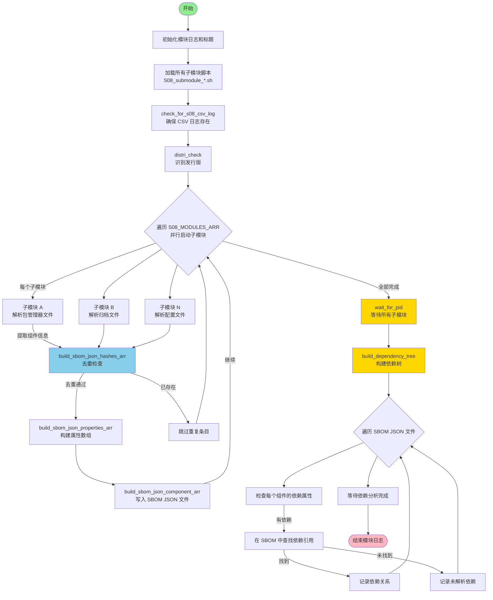

# S08_main_package_sbom.sh

## 模块概述

S08 是 EMBA 的包管理系统 SBOM 生成模块。它通过调度 22 个子模块，并行扫描固件中各种包管理系统的数据库文件和归档文件，提取软件组件信息（名称、版本、许可证、供应商、依赖关系等），生成 CycloneDX 格式的 SBOM 条目。

## 流程图



## 架构

### 主模块：`S08_main_package_sbom.sh`

| 函数 | 作用 |
|---|---|
| `S08_main_package_sbom()` | 主入口：加载子模块 → 并行调度 → 构建依赖树 |
| `build_dependency_tree()` | 遍历所有 SBOM JSON 文件，解析组件间的依赖关系 |
| `create_comp_dep_tree_threader()` | 分析单个组件的依赖关系，写入依赖树 JSON |
| `clean_package_details()` | 清理包详情中的特殊字符 |
| `clean_package_versions()` | 剥离版本号中的构建信息/发行版标识 |

### 调度流程

```
S08_main_package_sbom
  ├── 加载 22 个子模块脚本
  ├── 创建 S08_CSV_LOG（${CSV_DIR}/s08_package_mgmt_extractor.csv）
  ├── 识别发行版
  ├── 并行启动所有子模块（S08_MODULES_ARR）
  ├── 等待所有子模块完成
  └── 构建依赖树
```

## 子模块总览

| # | 子模块 | 包管理系统 | packaging_system | 数据来源 |
|---|---|---|---|---|
| 1 | `debian_pkg_mgmt_parser` | Debian dpkg | `debian_pkg_mgmt` | `dpkg/status` |
| 2 | `deb_package_parser` | Debian .deb | `debian_pkg_mgmt` | `*.deb` 归档 |
| 3 | `openwrt_pkg_mgmt_parser` | OpenWRT opkg | `OpenWRT` | `opkg/info/*.control` |
| 4 | `openwrt_ipk_package_parser` | OpenWRT .ipk | `openwrt_ipk_pkg` | `*.ipk` 归档 |
| 5 | `rpm_pkg_mgmt_parser` | RPM | `rpm_package_mgmt` | `rpm/Packages`, `rpm/rpmdb.sqlite` |
| 6 | `rpm_package_parser` | RPM .rpm | `rpm_package` | `*.rpm` 归档 |
| 7 | `bsd_package_parser` | FreeBSD .pkg | `freebsd_pkg` | `*.pkg` 归档 |
| 8 | `alpine_apk_package_parser` | Alpine .apk | `alpine_apk` | `*.apk` 归档 |
| 9 | `apk_pkg_mgmt_parser` | Alpine APK | `apk_pkg_mgmt` | `apk/db/installed` |
| 10 | `java_archives_parser` | Java JAR/WAR | `java_archive` | `*.jar`, `*.war`, `pom.xml` |
| 11 | `nodejs_pcklockparser` | Node.js npm | `node_js_lock` | `package.json`, `package-lock.json` |
| 12 | `python_pip_package_mgmt_parser` | Python pip | `python_pip` | `site-packages/METADATA` |
| 13 | `python_requirements_parser` | Python requirements.txt | `python_requirements` | `requirements*.txt` |
| 14 | `python_pipfile_lock` | Python Pipfile.lock | `python_pipfile_lock` | `Pipfile.lock` |
| 15 | `python_poetry_lock_parser` | Python poetry.lock | `python_poetry_lock` | `poetry.lock` |
| 16 | `php_composer_lock` | PHP composer.lock | `php_composer_lock` | `composer.lock` |
| 17 | `perl_cpan_parser` | Perl CPAN | `perl_cpan_mgmt` | `cpanfile` |
| 18 | `ruby_gem_archive_parser` | Ruby .gem | `ruby_gem` | `*.gem` 归档 |
| 19 | `rust_cargo_lock_parser` | Rust Cargo.lock | `rust_cargo_lock` | `Cargo.lock` |
| 20 | `c_conanfile_txt_parser` | C/C++ Conan | `conanfile_txt` | `conanfile.txt` |
| 21 | `windows_exifparser` | Windows PE | `windows_exe` | PE32/MSI 文件 |
| 22 | `sinamics_version_xml_parser` | 西门子 SINAMICS | `sinamics_version_xml` | `VERSIONS.XML` |

## 子模块详情

### 1. Debian dpkg 管理数据库（`debian_pkg_mgmt_parser`）
- **数据源**: 从 `P99_CSV_LOG` 中 grep `dpkg/status`
- **解析方法**: awk 按空行分隔记录，逐字段 grep `Package:`、`Version:`、`Maintainer:`、`Architecture:`、`Description:`、`Depends:`
- **依赖关系**: 解析 `Depends:` 字段并清理版本约束符

### 2. Debian .deb 归档（`deb_package_parser`）
- **数据源**: 从 `P99_CSV_LOG` 中 grep `\.deb;`
- **解析方法**: `ar x` 解包 → 处理 `control.tar.zst` 或 `control.tar.xz` → 读取 `./control` 文件
- **提取字段**: `Package`、`Version`、`Maintainer`、`Architecture`、`Description`、`License`、`Depends`

### 3. OpenWRT opkg 管理数据库（`openwrt_pkg_mgmt_parser`）
- **数据源**: 从 `P99_CSV_LOG` 中 grep `opkg/info/.*.control`
- **解析方法**: grep control 文件中的 `Package:`、`Version:`、`Maintainer:`、`Description:`、`Depends:`
- **文件列表**: 读取同名 `.list` 文件获取安装路径

### 4. OpenWRT .ipk 归档（`openwrt_ipk_package_parser`）
- **数据源**: 从 `P99_CSV_LOG` 中 grep `\.ipk;`
- **解析方法**: `tar zxpf` 解包 → 读取 `control.tar.gz` 中的 `./control` 文件
- **提取字段**: `Package`、`Architecture`、`Maintainer`、`Description`、`License`、`Version`、`Depends`

### 5. RPM 管理数据库（`rpm_pkg_mgmt_parser`）
- **数据源**: 从 `P99_CSV_LOG` 中 grep `rpm/Packages;` 或 `rpm/rpmdb.sqlite;`
- **解析方法**: `rpm -qa --dbpath` 列出包 → `rpm -qi` 获取 Name/Version/License/Architecture/Description
- **依赖关系**: `rpm -qR` -> Depends；`rpm -ql` -> 文件列表

### 6. RPM .rpm 归档（`rpm_package_parser`）
- **数据源**: 从 `P99_CSV_LOG` 中 grep `\.rpm;`
- **解析方法**: `file` 识别为 "RPM" → `rpm -qipl` 获取 Name/License/Version/Vendor/Architecture/Summary
- **依赖关系**: `rpm -qR` -> Depends；`rpm -qlp` -> 文件列表

### 7. FreeBSD .pkg（`bsd_package_parser`）
- **数据源**: 从 `P99_CSV_LOG` 中 grep `\.pkg;`
- **解析方法**: `tar --zstd` 提取 `+COMPACT_MANIFEST` → `jq` 解析
- **提取字段**: `.name`、`.version`、`.arch`、`.maintainer`、`.comment`、`.licenses`、`.deps[].origin`

### 8. Alpine .apk 归档（`alpine_apk_package_parser`）
- **数据源**: 从 `P99_CSV_LOG` 中 grep `\.apk;`
- **解析方法**: `tar -xzf` 解包 → 读取 `.PKGINFO` 
- **提取字段**: `pkgname =`、`pkgver =`、`license =`

### 9. Alpine APK 管理数据库（`apk_pkg_mgmt_parser`）
- **数据源**: 从 `P99_CSV_LOG` 中 grep `apk/db/installed`
- **解析方法**: 检查 `^C:` 标记 → awk 按空行分隔 → 逐字段解析单字母键
- **字段映射**: `P:` (名称)、`V:` (版本)、`m:` (维护者)、`A:` (架构)、`T:` (描述)、`L:` (许可证)、`D:` (依赖)、`R:` (文件引用)

### 10. Java 归档（`java_archives_parser`）
- **数据源**: 从 `P99_CSV_LOG` 中 grep `\.jar;`、`\.war;`、`pom.xml;`
- **解析方法**:
  - **MANIFEST.MF**: `unzip` 提取 → grep `Application-Name`、`Implementation-Version`、`Bundle-Version`、`Vendor`、`Bundle-Name`、`License`
  - **pom.xml**: `xpath` 提取 `project/version`、`project/artifactId`、`project/name`、`project/licenses/license/name`

### 11. Node.js（`nodejs_pcklockparser`）
- **数据源**: 从 `P99_CSV_LOG` 中 grep `/package.*json;`
- **解析方法**: `jq` 提取 `.name`、`.version`、`.license`、`.integrity`、`.dependencies`
- **依赖关系**: 通过 `jq` 遍历 `.packages` 条目解析依赖链

### 12. Python pip（`python_pip_package_mgmt_parser`）
- **数据源**: `find "${FIRMWARE_PATH}"` 查找 `site-packages` 和 `dist-packages` 目录（**不使用 P99_CSV_LOG**）
- **解析方法**: 查找 `METADATA` + `PKG-INFO` 文件 → grep 提取 `Name:`、`Version:`、`License:`、`Summary:`、`Author:`

### 13. Python requirements.txt（`python_requirements_parser`）
- **数据源**: 从 `P99_CSV_LOG` 中 grep `requirements.*\.txt`
- **解析方法**: 逐行解析，按 `==`、`>=`、`<`、`~=` 操作符分割
- **版本处理**: 使用 `clean_package_details` + `clean_package_versions` 清理

### 14. Python Pipfile.lock（`python_pipfile_lock`）
- **数据源**: 从 `P99_CSV_LOG` 中 grep `/Pipfile.*\.lock;`
- **解析方法**: `jq -rc '.default | to_entries[]'` 提取包名和版本

### 15. Python poetry.lock（`python_poetry_lock_parser`）
- **数据源**: 从 `P99_CSV_LOG` 中 grep `poetry.lock`
- **解析方法**: `sed` 将 `[[package]]` 块合并为 `|` 分隔行 → 提取 `name =`、`version =`、`description =`

### 16. PHP composer.lock（`php_composer_lock`）
- **数据源**: 从 `P99_CSV_LOG` 中 grep `/composer\.lock;`
- **解析方法**: `jq -rc '.packages[]'` 提取 `.name`、`.version`、`.description`、`.require`（依赖）
- **PURL 类型**: `packagist`

### 17. Perl CPAN（`perl_cpan_parser`）
- **数据源**: 从 `P99_CSV_LOG` 中 grep `cpanfile`
- **解析方法**: grep `requires ` 行 → awk `$2` 提取包名 → 从 `=>` 或 `,` 语法提取版本
- **PURL 类型**: `cpan`

### 18. Ruby .gem（`ruby_gem_archive_parser`）
- **数据源**: 从 `P99_CSV_LOG` 中 grep `\.gem;`
- **解析方法**: `tar -x` 解包 → `gunzip metadata.gz` → grep `name: ` + `version: ` → `tar -tvf data.tar.gz` 获取文件列表
- **PURL 类型**: `gem`

### 19. Rust Cargo.lock（`rust_cargo_lock_parser`）
- **数据源**: 从 `P99_CSV_LOG` 中 grep `Cargo.lock`
- **解析方法**: `sed` 将 `[[package]]` 块合并为 `|` 分隔行 → `cut -d|` 提取 `name =`、`version =`、`source =`、`checksum =`
- **PURL 类型**: `cargo`

### 20. C/C++ Conan（`c_conanfile_txt_parser`）
- **数据源**: 从 `P99_CSV_LOG` 中 grep `conanfile.txt`
- **解析方法**: `sed` 用 `ASDF` 标记连接续行 → 提取 `[requires]` / `[tool_requires]` 段 → 按 `/` 分割包名/版本
- **PURL 类型**: `conan`

### 21. Windows PE（`windows_exifparser`）
- **数据源**: 从 `P99_CSV_LOG` 中 grep `PE32\|MSI`（排除 ASCII/Unicode 文本）
- **解析方法**: `exiftool` 提取 **Product Name**（备用: Internal Name, File Name）、**Company Name**、**Product Version Number**、**Machine Type**
- **特点**: 高度并行化，批量处理多个 PE 文件

### 22. 西门子 SINAMICS XML（`sinamics_version_xml_parser`）
- **数据源**: 从 `P99_CSV_LOG` 中 grep `VERSIONS\.XML;`
- **解析方法**: `xmllint` + XPath 遍历 `versions/Component/FirmwareBasis/ComponentContainer/Component[]`
- **字段提取**: `category` 属性 → 名称，`IntVersion`/`ExtVersion` → 版本

## 数据流

```
P99 阶段（固件提取 + 文件索引）
    ↓ P99_CSV_LOG（包含所有文件路径、类型、哈希）
S08_main_package_sbom
    ├── 从 P99_CSV_LOG 按关键词过滤目标文件
    ├── 解析包信息
    ├── 去重检查（SHA-512 哈希 + 名称+版本）
    └── 写入 SBOM_LOG_PATH/*.json
    ↓
F15_cyclonedx_sbom → 合并所有 JSON → EMBA_cyclonedx_sbom.json
```

## 通用工作模式

每个子模块遵循统一的三步流程：

```
1. 定位包文件
   ├── 大多数子模块: grep "<pattern>" "${P99_CSV_LOG}" | cut -d ';' -f2
   └── Python pip: find "${FIRMWARE_PATH}" 直接扫描文件系统

2. 解析包元数据
   ├── 文本格式（dpkg/status, cpanfile 等）: shell 字符串解析
   ├── JSON 格式（composer.lock, package-lock.json）: jq 解析
   ├── 数据库格式（RPM）: rpm 命令
   ├── 归档格式（.deb, .ipk, .apk）: 解包后读取控制文件
   └── 二进制格式（PE）: exiftool

3. 写入 SBOM
   ① build_sbom_json_hashes_arr  → 计算哈希 + 去重检查
   ② build_sbom_json_properties_arr → 构建元数据属性
   ③ build_sbom_json_component_arr → 写入 ${SBOM_LOG_PATH}/*.json
```

## 共享 SBOM 辅助库（`helpers_emba_sbom_helpers.sh`）

| 函数 | 作用 |
|---|---|
| `build_sbom_json_properties_arr` | 构建 properties 数组（路径、架构、置信度等） |
| `build_sbom_json_hashes_arr` | 计算 MD5/SHA-256/SHA-512 哈希 + 去重检查 |
| `build_sbom_json_component_arr` | 用 `jo` 序列化为 JSON，写入 `SBOM_LOG_PATH/*.json` |
| `check_for_s08_csv_log` | 确保 S08_CSV_LOG 文件存在并写入表头 |
| `build_purl_identifier` | 构建 PURL 标识符 |
| `translate_vendor` | 供应商名称标准化 |

## 去重机制

```
build_sbom_json_hashes_arr
  ├── 1. 检查同 SHA-512 + 同名称 + 同版本 → 跳过（return 1）
  ├── 2. 检查同名称 + 同版本但不同文件 → 合并到已有 JSON（追加 source_path）
  └── 3. 检查 unhandled_file 是否有同哈希条目 → 标记删除
```

## 依赖树构建

`build_dependency_tree()` 在子模块全部完成后运行：

1. 读取所有 `SBOM_LOG_PATH/*.json` 文件
2. 对每个组件，提取 `properties` 中 `dependency:` 前缀的条目
3. 在同源组件中查找匹配的依赖名称
4. 记录依赖关系到 `SBOM_LOG_PATH/SBOM_deps/SBOM_dependency_*.json`
5. 汇总到 `SBOM_LOG_PATH/SBOM_dependencies.txt`

## 关键配置

- **S08_CSV_LOG**: `${CSV_DIR}/s08_package_mgmt_extractor.csv`
- **SBOM_LOG_PATH**: `${LOG_DIR}/SBOM`
- **S08_MODULES_ARR**: 默认启用全部 22 个子模块，可通过扫描配置文件选择性启用
- **线程模式**: 子模块间通过后台进程并行执行

## 与其他模块的交互

| 模块 | 交互方式 |
|---|---|
| **P99** | 从 `P99_CSV_LOG` 获取文件和哈希信息 |
| **S09** | S09 检查 S08 是否启用以决定是否优化文件数组 |
| **F10** | 读取 `SBOM_LOG_PATH` 汇总许可证清单 |
| **F15** | 合并所有 SBOM JSON → `EMBA_cyclonedx_sbom.json` |
| **F17** | 基于 SBOM 组件列表做 CVE 匹配 |
| **Q20** | 上传 SBOM 到 Dependency Track |
