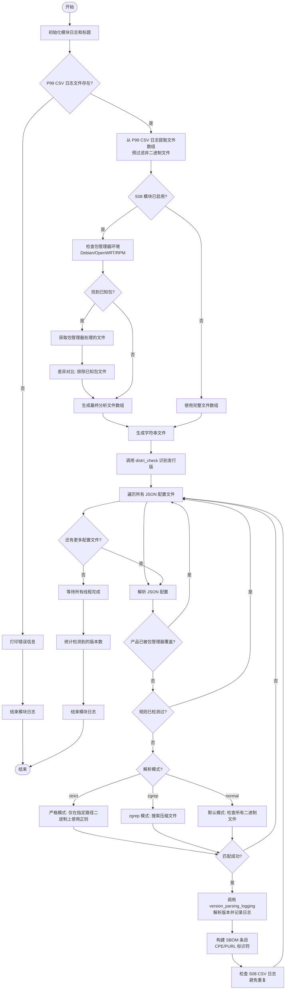

# S09_firmware_base_version_check.sh

## 模块概述

该模块用于静态检测固件中二进制文件的版本信息。它通过正则表达式匹配配置文件中的版本标识符，识别固件中包含的软件组件及其版本。

## 流程图



## 主要流程说明

| 阶段 | 函数 | 作用 |
|---|---|---|
| **初始化** | `S09_firmware_base_version_check` | 设置日志、加载配置、过滤文件 |
| **包管理器优化** | 内联逻辑 | 排除 Debian/OpenWRT 已处理的文件，减少分析范围 |
| **字符串生成** | `generate_strings` | 为二进制文件提取字符串 |
| **版本检测** | `S09_identifier_threadings` | 根据 JSON 规则匹配版本标识符 |
| **三种检测模式** | - | strict（严格路径）、zgrep（压缩文件）、normal（通用） |
| **日志记录** | `version_parsing_logging` | 解析版本、构建 CPE/PURL、写入 SBOM |
| **去重检查** | `check_for_s08_csv_log` | 避免与 S08 模块重复 |

## 三种检测模式

### strict 模式
- 仅对 JSON 配置中指定路径的二进制文件使用正则表达式
- 适用于有明确安装路径的软件组件
- 跳过 RTOS 模式

### zgrep 模式
- 使用 zgrep 搜索压缩文件中的版本信息
- 适用于需要在压缩包中查找版本的场景

### normal 模式（默认）
- 遍历所有二进制文件进行版本匹配
- RTOS 模式下同时测试原始固件文件
- 支持 multi_grep 多正则匹配

## 关键配置

- **线程优先级**: `THREAD_PRIO=1`，优先执行
- **置信度级别**: 默认为 3（medium）
- **配置文件路径**: `config/bin_version_identifiers/*.json`

## 与其他模块的交互

| 模块 | 交互方式 |
|---|---|
| P99 | 读取 P99 CSV 日志获取文件列表 |
| S08 | 检查包管理器分析结果，避免重复 |
| F15 | 输出 SBOM 条目用于最终报告生成 |

## S08 与 S09 的分工协作

### 职责划分

| 模块 | 职责 | 数据来源 | 输出 |
|---|---|---|---|
| **S08** | 包管理系统 SBOM 生成 | 包管理器数据库文件（dpkg/status, opkg/info, RPM 数据库等） | SBOM 条目 + 依赖树 |
| **S09** | 静态二进制版本检测 | 二进制文件中的版本字符串 | SBOM 条目 + 版本信息 |

### S08 处理的包管理系统

- Debian/Ubuntu（dpkg）
- OpenWRT（opkg）
- RPM（rpm）
- Alpine Linux（apk）
- Java（JAR/WAR）
- Node.js（package-lock.json）
- Python（pip, requirements.txt, Pipfile.lock, poetry.lock）
- PHP（composer.lock）
- Ruby（.gem）
- Rust（Cargo.lock）
- C/C++（conanfile.txt）
- Windows PE（ExifTool）
- 西门子 SINAMICS（XML）

### S09 处理的场景

- 非包管理器安装的二进制文件
- 静态编译的程序
- 自定义固件组件
- 未被 S08 覆盖的软件

### 协作机制

```
S08 和 S09 并行运行，各自独立获取包管理器信息
     ↓
S09 检查 S08 是否被启用（MODULES_EXPORTED 数组）
     ↓
S09 自己重新扫描固件目录中的包管理器文件
  - dpkg/info/*.list (Debian)
  - dpkg/status (Debian)
  - opkg/info/*.list (OpenWRT)
  - opkg/status (OpenWRT)
     ↓
S09 排除已知文件，只分析剩余文件
     ↓
两个模块都写入同一个 S08_CSV_LOG
通过 check_for_s08_csv_log 确保日志文件存在
```

### 关键澄清

**S09 不依赖 S08 的输出！** S09 直接从固件目录扫描包管理器文件，而不是等待 S08 完成。这是因为：
1. S08 和 S09 是并行运行的
2. S09 自己重新扫描固件中的包管理器数据库文件
3. 两者读取相同的源数据（固件中的包管理器文件）

### 避免重复的机制

1. **文件级排除**: S09 直接扫描固件中的包管理器文件，排除已知文件
2. **产品级检查**: S09 在处理每个规则时，检查产品是否已被包管理器覆盖（第 278-293 行）
3. **日志级去重**: 两个模块都写入 `S08_CSV_LOG`，通过 `check_for_s08_csv_log` 函数确保日志格式一致
4. **规则级跳过**: S09 检查规则是否已检测过，避免重复测试（第 300-304 行）

### 代码示例

```bash
# S09 检查 S08 是否已启用（不是等待 S08 完成）
if [[ " ${MODULES_EXPORTED[*]} " == *S08* ]]; then
  # S09 直接从固件目录扫描包管理器文件（不依赖 S08 的输出）
  find "${LOG_DIR}"/firmware -path "*dpkg/info/*.list" -type f -print0 | xargs -r -0 -P 16 -I % sh -c 'cat "%"' | sort -u > "${LOG_PATH_MODULE}"/debian_known_files.txt
  find "${LOG_DIR}"/firmware -path "*dpkg/status" -type f -exec grep "^Package: " {} \; | awk '{print $2}' | sort -u > "${LOG_PATH_MODULE}"/debian_known_packages.txt
  find "${LOG_DIR}"/firmware -path "*opkg/info/*.list" -type f -print0 | xargs -r -0 -P 16 -I % sh -c 'cat "%"' | sort -u > "${LOG_PATH_MODULE}"/openwrt_known_files.txt
  find "${LOG_DIR}"/firmware -path "*opkg/status" -type f -exec grep "^Package: " {} \; | awk '{print $2}' | sort -u > "${LOG_PATH_MODULE}"/openwrt_known_packages.txt
  
  # 排除已知文件，只分析剩余文件
  comm -23 firmware_binaries_sorted.txt known_system_pkg_files_sorted.txt > known_system_files_diffed.txt
fi

# S09 检查产品是否已被包管理器覆盖
for lPRODUCT_NAME in "${lPRODUCT_NAME_ARR[@]}"; do
  if grep -q "^${lPRODUCT_NAME}" "${LOG_PATH_MODULE}"/debian_known_packages.txt; then
    print_output "[*] Static rule for identifier ${lRULE_IDENTIFIER} - product name ${lPRODUCT_NAME} already covered by debian package manager" "no_log"
    return
  fi
done
```

### 总结

- **S08** 是"精确匹配"：通过包管理器数据库获取准确的软件组件信息
- **S09** 是"模糊匹配"：通过正则表达式匹配二进制文件中的版本字符串
- **分工原则**: S08 处理已知的包管理系统，S09 处理剩余的二进制文件
- **并行运行**: S08 和 S09 并行运行，各自独立获取包管理器信息
- **协作目标**: 确保固件中的所有软件组件都能被识别，同时避免重复分析
